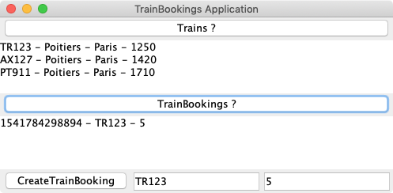

# Exercice 4 (JAX-RS) : client de service web REST « Interrogation et réservation de billets de train »

Ce quatrième exercice s'intéresse à la mise en place d'un client pour l'accès au service web REST développé dans les exercices 2 et 3. Une interface graphique développée en Java/Swing permet d'invoquer les services web pour les ressources de *train* et de *réservation de billets de train*.

Le projet de l'exercice 3 fournira l'implémentation du service web REST que le client que nous allons développer va invoquer. Exécuter la classe `TrainBookingLauncher` de l'exercice 3 pour rendre disponible le service web REST.



## But

* Utiliser l'API cliente de JAX-RS et son implémentation via Jersey.
* Savoir manipuler le type de contenu.

## Étapes à suivre

* Démarrer l'environnement de développement Eclipse.

* Importer le projet Maven **jaxrs-tutorial-exercice4** (**File -> Import -> Maven -> Existing Maven Projects**), choisir le répertoire du projet, puis faire **Finish**.

> Le projet importé contient déjà une implémentation complète de l'interface graphique développée en Java/Swing. Aucune compétence en Java/Swing n'est demandée puisque l'objectif de cet exercice est de manipuler exclusivement l'API cliente JAX-RS. Si vous souhaitez proposer des améliorations à l'interface graphique, les *pull requests* sont les bienvenues.

* Éditer le fichier de description Maven *pom.xml* et ajouter la dépendance suivante afin d'utiliser l'API cliente JAX-RS et son implémentation Jersey.

```xml
<dependency>
    <groupId>org.glassfish.jersey.core</groupId>
    <artifactId>jersey-client</artifactId>
</dependency>
```

* Ouvrir la classe `TrainBookingsClientMain` et compléter le code de la méthode `initializeService` afin d'initialiser l'attribut `WebTarget target`. Pour rappel, l'URL d'accès au service web REST est <http://localhost:9993/api/trains>.

```java
    private void initializeService() {
        Client client = ClientBuilder.newClient();
        target = client.target("http://localhost:9993/api/trains");
    }
```

* Compléter la méthode `callGetTrains` permettant de récupérer l'ensemble des trains et de les afficher dans le composant graphique `JTextArea`.

```java
    private void callGetTrains() {
        // TODO: invoquer le service web REST pour récupérer l'ensemble des trains
        // disponibles. Le résultat doit être transmis dans un objet de type
        // List<Train>.

        trainsConsole.setText("");
        for (Train current : result) {
            trainsConsole.append(current.getId() + " - " + current.getDeparture() + " - " + current.getArrival() + " - "
                + current.getDepartureTime() + "\n");
        }
    }
```

La classe `Train` n'existe pas dans le projet. Comme nous n'utilisons pas une démarche Top/Down, toutes les classes utilisées pour transmettre des données via les requêtes et les réponses ne sont pas générées automatiquement. La solution la plus rapide est de « copier/coller » la classe `Train` de l'exercice 3.

* Copier depuis l'exercice 3, la classe `Train` en vous assurant si possible de modifier le nom du package par `fr.mickaelbaron.jaxrstutorialexercice4`.

```java
package fr.mickaelbaron.jaxrstutorialexercice5;

@XmlRootElement(name = "train")
public class Train {

    private String id;

    private String departure;

    private String arrival;

    @JsonProperty("departure_time")
    private int departureTime; // Format : 1230 = 12h30

    ...
```

* Compléter la méthode `createTrainBooking` permettant de créer des réservations de billet de train. Les informations pour la création comme l'identifiant du train et le nombre de places sont renseignées en paramètre de la méthode (valeurs extraites depuis les champs de texte de l'interface graphique).

```java
    private void createTrainBooking(String numTrain, int numberPlaces) {
        // TODO: créer un objet de type TrainBooking.

        // TODO: invoquer le service web REST pour créer une réservation de train
        // à partir de l'objet TrainBooking.

        if (Status.OK.getStatusCode() == post.getStatus()) {
            System.out.println(post.readEntity(TrainBooking.class).getId());
        }
    }
```

* Compléter la méthode `callGetTrainBookings` permettant de récupérer l'ensemble des réservations de billet de train et de les afficher dans le composant graphique `JTextArea`.

```java
    private void callGetTrainBookings() {
        // TODO: invoquer le service web REST pour récupérer l'ensemble des réservations
        // de billet de train.
        // Le résultat doit être transmis dans un objet de type List<TrainBooking>

        for (TrainBooking current : result) {
            trainBookingsConsole.append(current.getId() + " - " + current.getTrainId() + " - " + current.getNumberPlaces());
        }
    }
```

* Même problème pour la classe `TrainBooking` qui n'existe pas. Copier depuis l'exercice 3, la classe `TrainBooking` en vous assurant si possible de modifier le nom du package par `fr.mickaelbaron.jaxrstutorialexercice4`.

```java
package fr.mickaelbaron.jaxrstutorialexercice5;

@XmlRootElement(name = "trainbooking")
public class TrainBooking {

    private String id;

    @JsonProperty("current_train")
    private String trainId;

    @JsonProperty("number_places")
    private int numberPlaces;

    ...
```

* Tester votre programme client en invoquant les trois fonctionnalités développées précédemment.